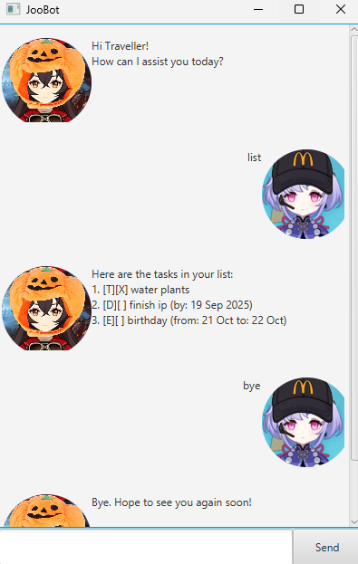

# JooBot User Guide

## Joobot
JooBot is a simple chat-bot application to keep track of tasks.
It has a Graphical User Interface that is built using JavaFX.

This is an individual greenfield project for NUS module CS2103T Software Engineering.

## Launching JooBot

1. Ensure you have Java 17
2. Install the latest JooBot.jar
3. Run the jar file. If that doesn't work, run using 
    `java -jar JooBot.jar`

## Features
- Add Todo Task
- Add Deadline Task
- Add Event Task
- List all Tasks
- Delete Task
- Mark Task as done / undone
- Sort Tasks
- Find a Task

### Add Todo Task
Command Format: `todo {description}`

Example:  
`todo read book`

### Add Deadline Task
Command Format: `deadline {description} /by {date}`

Example:  
`deadline homework /by tomorrow`  
`deadline homework /by 04/05/2025 1200`

- Date format can be in the form of any string or `DD/MM/YYYY HHMM`

### Add Event Task
Command Format: `event {description} /from {date} /to {date}`

Example:  
`event camp /from wednesday /to friday`  
`event camp /from 05/06/2025 1200 /to 07/06/2025 1200`

- Date format can be in the form of any string or `DD/MM/YYYY HHMM`

### List all Tasks
Command Format: `list`

### Delete Task
Command Format: `delete {index}`

- Index of task can be found after typing command `list`

### Mark Task
Command Format: `mark {index}` or `unmark {index}`

- Index of task can be found after typing command `list`

### Sort Tasks
Command Format: `sort`

- Sorts tasks based on alphabetical order

### Find a Task
Command Format: `find {description}`

- Prints all tasks that has that description

### Command Summary
Add Todo       | `todo {description}`                          | `todo read book`                 |  
Add Deadline   | `deadline {description} /by {date}`           | `deadline homework /by tomorrow` |  
Add Event      | `event {description} /from {date} /to {date}` | `event camp /from wed /to fri`   |  
List all Tasks | `list`                                        | `list`                           |  
Delete Task    | `delete {index}`                              | `delete 1`                       |  
Mark Task      | `mark {index}`                                | `mark 1`                         |  
Unmark Task    | `unmark {index}`                              | `unmark 1`                       |  
Sort Tasks     | `sort`                                        | `sort`                           |  
Find Task      | `find {description}`                          | `find book`                      |  